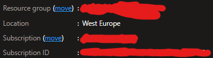

# DemoPerformance

## About The Project
This project was created so that with a few simple inputs you will have a working Kubernetes environment right away. It will also be testable thanks to the testing and control resources that are installed with it.

## Getting Started
Follow the instructions to prepare the environment before start the pipeline.
The first thing to do before installation is to fork your repository.


### Prerequisites
Access your azure subscription with "administrative credentials"

## Installation

### 1. Create a resource group that will contain the resources that will be generated 
  Sample: 
  ```console
  az group create -l "switzerlandnorth" -n "DEMO"
  ```
Reference: https://docs.microsoft.com/en-us/cli/azure/group?view=azure-cli-latest

## 2. Create a management identity and assign the owner role to the group created in the previous step. Save the statement output in Notepad for use in the next step
Sample 
```console
az ad sp create-for-rbac --name "DEMO" --role owner --scopes /subscriptions/744dd6eb-f4a1-4ff3-bc6b-ecec2fb8c22e/resourceGroups/DEMO --sdk-auth
```
Reference: https://docs.microsoft.com/en-us/azure/developer/github/connect-from-azure?tabs=azure-cli%2Clinux

## 3. Copy the full output from the previous step inside the GitHub secret key AZURE_CREDENTIALS. You can find AZURE_CREDENTIALS in GitHub "Setting-->Secret-->Actions"

Sample
```json
{
  "clientId": "651ca1e0-XXXX-XXXX-XXXX-aa7c11e10a57",
  "clientSecret": "QOFEWIJFQewfEWFewqFewFewfEWf34_h.pj",
  "subscriptionId": "74LVd6eb-XXXX-XXXX-XXXX-ecec2fm3c22e",
  "tenantId": "72f988bf-XXXX-XXXX-XXXX-2d7cd011db47",
  "activeDirectoryEndpointUrl": "https://login.microsoftonline.com",
  "resourceManagerEndpointUrl": "https://management.azure.com/",
  "activeDirectoryGraphResourceId": "https://graph.windows.net/",
  "sqlManagementEndpointUrl": "https://management.core.windows.net:8443/",
  "galleryEndpointUrl": "https://gallery.azure.com/",
  "managementEndpointUrl": "https://management.core.windows.net/"
}
```

## 4. Create a GitHub secret named AZURE_RG containing Resource Group name, create another secret named AZURE_SUBSCRIPTION containing the Azure Subscription ID and create another secret names GRAFANA_ADMIN_PASSWORD containing the password to access Grafana 



## 5. Customize resources names file with: .github\workflows\main.yml
```
Customize value for following keys: 
  AZUREAPPLICATIONINSIGHTSNAME:   "DEMOApplicationInsights"
  CONTAINERREGISTRYNAME:          "DEMOContainerRegistry"
  CONTAINERREGISTRYNAMELOWER:     "democontainerregistry"
  REPOSITORYNAME:                 "demorepository"
  APPNAME:                        "demo"
  KUBERNETESSERVICENAME:          "DEMOKubernetesService"
  AZURELOGANALYTICSWORKSPACENAME: "DEMOLogAnalyticsWorkspace"
  AZURELOADTESTINGNAME:           "DEMOAzureLoadTesting"
```
## 6. Microsoft.Chaos and Microsoft.LoadTestService must be registered in the Resource Providers section of the subscription
```
- To be able to register the services you need to go to the Azure portal
- Select the "Subscription" and in the left menu select "Resource Providers".
```

```
- Search "Microsoft.Chaos" and make the Status: Registered.
```

```
- Search "Microsoft.LoadTestService" and make the Status: Registered.
```


## 7. Azure Load Test configuration

To run load tests, you need to upload the *.jmx file and the test configuration file to the ALT "./Bicep/ALT" folder.
Upload the files needed to create the tests before starting the pipeline

# Other references

https://docs.microsoft.com/en-us/azure/chaos-studio/chaos-studio-tutorial-aks-portal#set-up-chaos-mesh-on-your-aks-cluster

https://github.com/Azure/bicep/blob/main/docs/examples/101/aks/main.bicep

https://docs.microsoft.com/en-us/azure/templates/microsoft.containerservice/managedclusters?tabs=bicep

https://github.com/Azure/bicep/blob/main/docs/examples/101/container-registry/main.bicep

https://docs.microsoft.com/en-us/azure/templates/microsoft.insights/2018-05-01-preview/components?tabs=bicep

https://docs.microsoft.com/en-us/azure/developer/github/connect-from-azure?tabs=azure-cli%2Clinux

https://docs.microsoft.com/en-us/cli/azure/install-azure-cli-windows?tabs=azure-cli

https://docs.microsoft.com/en-us/azure/azure-resource-manager/bicep/deploy-github-actions?tabs=CLI#create-workflow

https://docs.microsoft.com/en-us/azure/templates/microsoft.containerservice/2021-03-01/managedclusters?tabs=bicep#managedclusteridentity

https://docs.microsoft.com/en-us/azure/templates/microsoft.loadtestservice/loadtests?tabs=bicep

https://github.com/marketplace/actions/azure-container-registry-build

https://docs.microsoft.com/en-us/azure/container-registry/container-registry-authentication?tabs=azure-cli#authentication-options

https://docs.microsoft.com/en-us/azure/aks/concepts-clusters-workloads#deployments-and-yaml-manifests

https://docs.microsoft.com/en-us/cli/azure/acr/credential?view=azure-cli-latest#az-acr-credential-show

https://docs.microsoft.com/en-us/azure/aks/internal-lb#create-an-internal-load-balancer

https://docs.microsoft.com/en-us/azure/azure-resource-manager/templates/deploy-cli

https://docs.microsoft.com/en-us/azure/load-testing/tutorial-cicd-github-actions#define-test-passfail-criteria

https://stackoverflow.com/questions/57877200/how-can-i-pass-a-variable-group-in-jmeter-using-azure-pipeline

https://docs.microsoft.com/en-us/azure/load-testing/how-to-parameterize-load-tests
